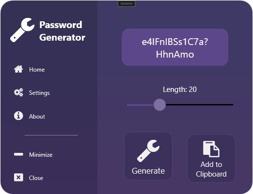
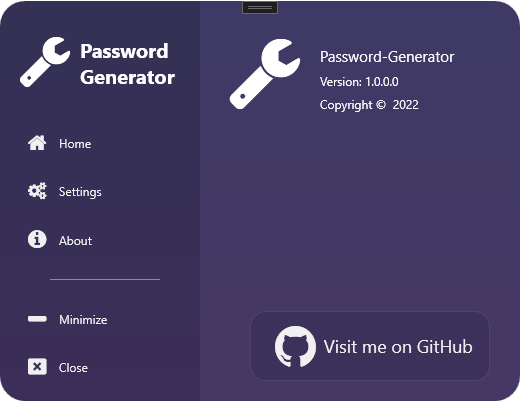

# Password-Generator

This tool generates some random password. It's much more secure than a regular password.

Features include:

- You can choose the length of the password.
- You can choose a password with lower case letters, upper case letters, numbers, special letters (:;#+-_/) or spaces.
- With one click you can add the generated password to clipboard.

## Screenshots

    
	
	

